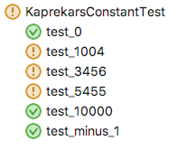

# Java Interview Question

### Kaprekar's Constant

* Take any four digit number (whose digits are not all identical).
* Rearrange the string of digits to form the largest and smallest 4-digit numbers possible.
* Take these two 4-digit numbers and subtract the smaller from the larger.
* Use this new four digit number and repeat the above process until you arrive at Kaprekar's constant of 6174.
* Return the count of the number of iterations it took to arrive at this constant.

Complete the algorithm in the [KaprekarsConstant](src/main/java/com/github/markboydcode/questions/KaprekarsConstant.java) class using the provided [unit tests](src/test/java/com/github/markboydcode/questions/KaprekarsConstantTest.java) to verify your implementation. Several tests already pass. The remainder should pass once your implementation is complete.

  
